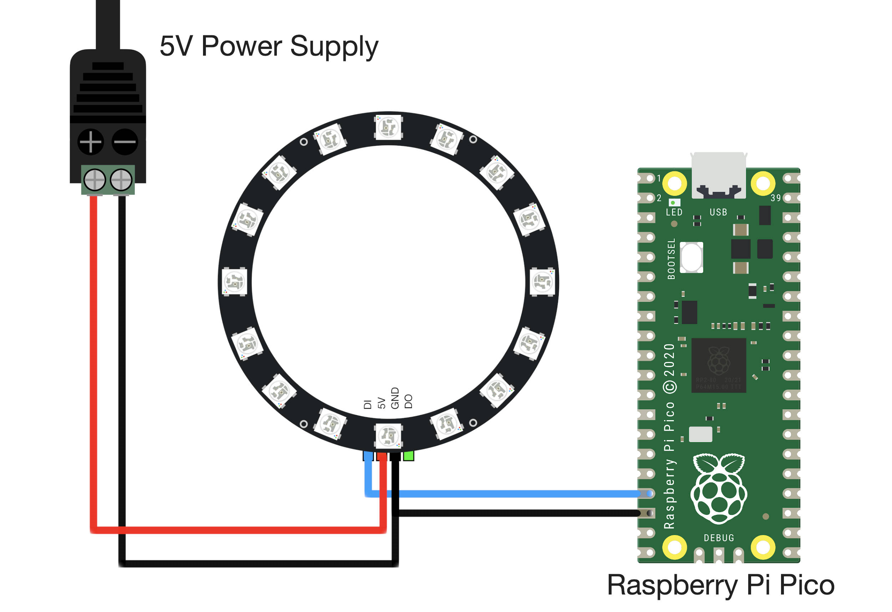

# Raspberry Pi Pico WS2812B Ring Light Control
Raspberry Pi Pico RGB LED (WS2812) Ring Light Control with MicroPython 

### JUMP TO:
<a href="#start">- Wiring Diagram</a> 
<a href="#state">- MicroPython State Machine</a> 
<a href="#google">- Google Home LED Emulator </a> 

The RPi Pico WS2812 library can be downloaded using git:

    git clone https://github.com/makerportal/rpi-pico-ws2812

# - Wiring Diagram -
The wiring diagram between the Raspberry Pi Pico and a 16-pixel RGB LED ring light is shown below:

The pinout wiring is also given in the table below:

| Power Supply | Pico | Ring Light |
| --- | --- | --- |
| + | N/A | 5V |
| N/A | GPIO13 | DI | 
| - | GND | GND |

Most of the GPIO pins can be used to control the WS2812 LED array, thus, the specification of GPIO13 for controlling the light is arbitrary. Be sure to change the pin in the codes as well, if using another pin for wiring.

# - MicroPython State Machine -
The 16-Pixel LED Ring Light will be controlled using the scheme outlined in the [Raspberry Pi Pico MicroPython getting started document][https://datasheets.raspberrypi.org/pico/raspberry-pi-pico-python-sdk.pdf], where a tutorial entitled “Using PIO to drive a set of NeoPixel Ring (WS2812 LEDs)” contains a script to create a state machine on the Pico. The state machine will be used to control the LEDs on the ring light using a single pin on the Pico. The full MicroPython example script can also be found at the Raspberry Pi Pico’s NeoPixel Ring repository on GitHub.

# - Google Home LED Emulator -
